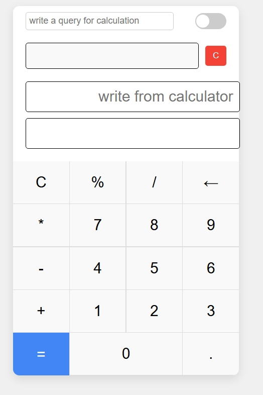
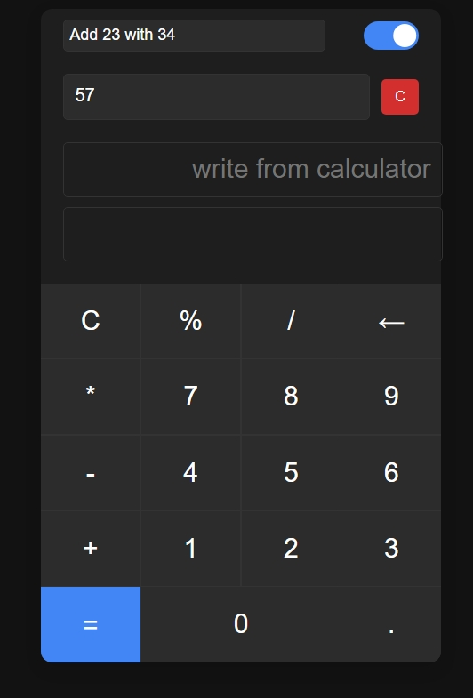
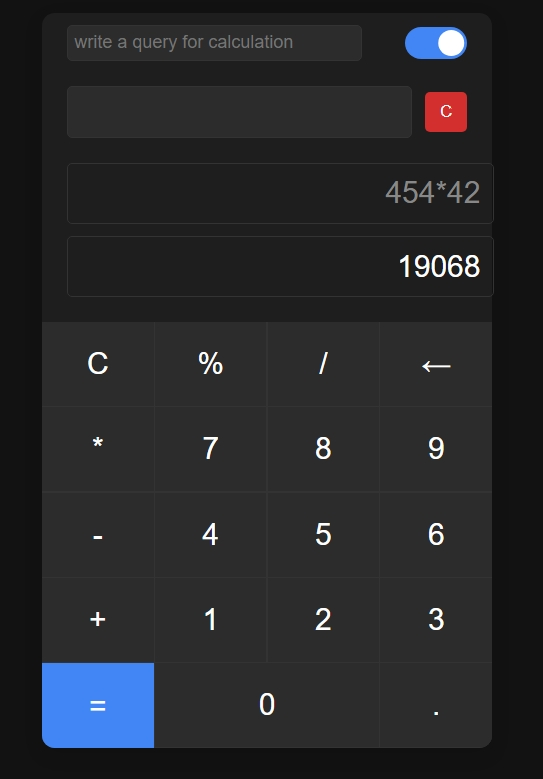

# Smart Calculator

This project contains a simple calculator that can parse natural language queries and a web interface to interact with it.

## Screenshots of output

### Before any execution<br>
()

### Query execution<br>
()

### Calculator execution<br>
()

## Prerequisites

- Python 3.6+

## Installation

1.  **Clone the repository:**

    ```bash
    git clone https://github.com/your-username/SmartCalculator.git
    ```

2.  **Install the dependencies:**

    ```bash
    pip install fastapi uvicorn
    ```

## How to run the web application

1.  **Start the backend server:**

    ```bash
    uvicorn api:app --reload
    ```

2.  **Open the frontend:**

    Open the `index.html` file in your web browser.

3.  **Use the calculator:**

    Enter your calculation query in the input box and click "Calculate".

## How to run the command-line application

```bash
python main.py
```